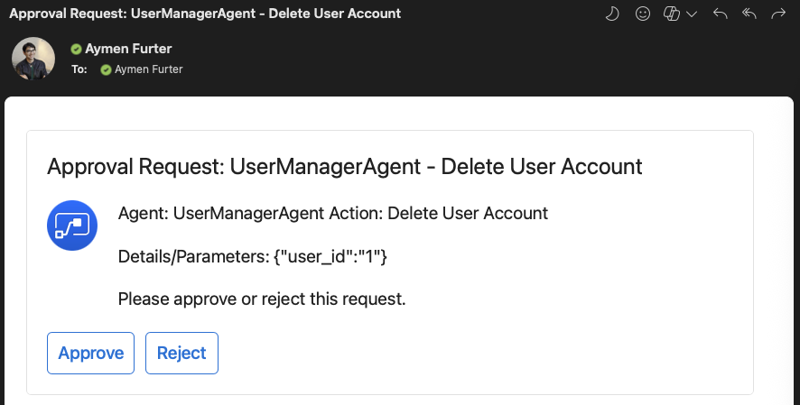

<div align="center">
  
</div>

# Human Oversight for AI Agents

[](https://github.com/microsoft/agents-humanoversight/actions/workflows/tests.yml)
[](https://www.python.org/downloads/)
[](https://azure.microsoft.com/services/logic-apps/)
[](https://github.com/microsoft/agents-humanintheloop/pulls)
[](https://opensource.org/licenses/MIT)

This solution accelerator provides a pattern for integrating human approval steps into autonomous AI agent workflows using Azure Logic Apps and a Python decorator. As AI systems become more powerful and autonomous, implementing human oversight mechanisms becomes critical for safety and compliance.


## Table of Contents
- [Why Human Oversight for AI Systems?](#why-human-oversight-for-ai-systems)
- [How It Works](#how-it-works)
- [Code Example](#code-example)
- [Included Demos](#included-demos)
  - [1. OpenAI Client Demo (`app/openai_client_demo.py`)](#1-openai-client-demo-appopenai_client_demo.py)
  - [2. Semantic Kernel Multi-Agent Demo (`app/sk_demo.py`)](#2-semantic-kernel-multi-agent-demo-appsk_demo.py)
- [Deploying the Solution](#deploying-the-solution)
  - [Prerequisites](#step-1-prerequisites)
  - [Setup](#step-2-clone-the-repository-and-set-up-environment)
  - [Deploy Azure Resources](#step-3-deploy-azure-resources-using-bicep)
  - [Authorize Office 365](#step-4-authorize-office-365-connection)
  - [Configure Python App](#step-5-configure-and-run-the-python-application)
- [Approval Workflow Experience](#approval-workflow-experience)
- [Reporting](#reporting)
- [Customizing the Solution](#customizing-the-solution)
- [Security Considerations](#security-considerations)
- [Contributing](#contributing)


## Why Human Oversight for AI Systems?

Autonomous AI agent systems can perform complex tasks with minimal supervision, but certain critical actions should require human approval before execution, such as:

- Deleting or modifying important resources
- Taking actions that impact user data or privacy
- Financial transactions or high-risk operations
- Actions with significant business impact or security implications

This solution provides a flexible, auditable human approval workflow that can be easily integrated into existing AI agent code with minimal changes. The design is orchestrator-agnostic, allowing it to work with virtually any AI agent framework or orchestration system.

## How It Works

1. Your AI agent uses a tool or function that has been annotated with the `@approval_gate` decorator
2. The decorator intercepts the action and sends the details to an Azure Logic App
3. The Logic App emails designated approvers with action details and approve/reject buttons
4. The Python code waits for a response (with configurable timeout)
5. If approved, the original tool/function executes; if rejected or timed out, a default value is returned

<div align="center">
  
</div>

## Code Example

Here's a real-world example from the included sample application:

```python
from human_oversight import approval_gate

# Regular function - no approval required
def list_users(location_filter: str = None):
    """Lists users, optionally filtering by location (domain part of email)."""
    print(f"Executing list_users(location_filter='{location_filter}')...")
    if not location_filter:
        return json.dumps(list(MOCK_USERS.values()))
    else:
        filtered_users = [
            user for user in MOCK_USERS.values()
            if user["email"].endswith(f"@{location_filter}")
        ]
        return json.dumps(filtered_users)

# Critical function with approval gate
@approval_gate(
    agent_name=AGENT_NAME,
    action_description="Delete User Account",
    approver_emails=APPROVERS,
    refusal_return_value="DENIED: User deletion was not approved.", 
)
def delete_user(user_id: str):
    """Deletes a user account. Requires human approval via the Approval Gate."""
    print(f"Executing delete_user(user_id='{user_id}')...")
    if user_id in MOCK_USERS:
        deleted_user = MOCK_USERS.pop(user_id)
        print(f"Successfully deleted user: {deleted_user['name']} (ID: {user_id})")
        return json.dumps({
            "status": "success", 
            "message": f"User {user_id} deleted.", 
            "deleted_user": deleted_user
        })
    else:
        print(f"User ID '{user_id}' not found.")
        return json.dumps({
            "status": "error", 
            "message": f"User {user_id} not found."
        })
```

## Included Demos

The project includes two demo applications:

### 1. OpenAI Client Demo (`app/openai_client_demo.py`)

This demo shows an integration with the Azure OpenAI client. It demonstrates:
- Direct tool usage with OpenAI function calling
- Human oversight for critical operations (user deletion)
- Simple prompt-based interaction

```bash
# Run the OpenAI Client demo
cd app
python openai_client_demo.py
```

### 2. Semantic Kernel Multi-Agent Demo (`app/sk_demo.py`)

This more advanced demo showcases integration with Microsoft's Semantic Kernel framework in a multi-agent system:
- A collaborative system with three specialized agents (Researcher, Critic, Publisher)
- GitHub code search capabilities
- Human oversight for publishing operation
- Complex agent-to-agent interactions

```bash
# Run the Semantic Kernel demo
cd app
python sk_demo.py
```

## Deploying the Solution

### Step 1: Prerequisites

- Azure Subscription
- Azure CLI installed and logged in
- Office 365 account with permissions to send emails

### Step 2: Clone the Repository and Set Up Environment

```bash
git clone https://github.com/microsoft/agents-humanoversight.git
cd agents-humanoversight
```

### Step 3: Deploy Azure Resources using Bicep

```bash
# Login to Azure
az login

# Set your subscription
az account set --subscription "<Your-Subscription-ID>"

# Create resource group
az group create --name "rg-human-oversight" --location "eastus"

# Deploy resources using Bicep
cd deployment
az deployment group create \
    --resource-group "rg-human-oversight" \
    --template-file main.bicep
```

The deployment will output several values, including:
- `logicAppUrl` - Required for the Python application
- `storageAccountName` - For storing approval logs
- `approvalsTableName` - Table name for approval logs

### Step 4: Authorize Office 365 Connection

This critical step requires manual authorization in the Azure Portal:

1. Go to the [Azure Portal](https://portal.azure.com)
2. Navigate to your resource group ("rg-human-oversight")
3. Find and click on the API Connection resource named "office365"
4. In the left menu, click on "Edit API connection"
5. Click the "Authorize" button
6. Sign in with your Office 365 account when prompted
7. After successful authorization, the connection status should show "Connected"
8. Click "Save" to save the connection

<div align="center">
  
</div>

### Step 5: Configure and Run the Python Application

1. Navigate to the application directory:
   ```bash
   cd ../app
   ```

2. Create a `.env` file with the required configuration:
   ```
   HO_LOGIC_APP_URL=<logicAppUrl-from-deployment-output>
   APPROVER_EMAILS=approver1@example.com,approver2@example.com
   
   # Optional for OpenAI integration
   AZURE_OPENAI_ENDPOINT=<your-endpoint>
   AZURE_OPENAI_API_KEY=<your-api-key>
   AZURE_OPENAI_DEPLOYMENT_NAME=<your-deployment>
   ```

3. Install dependencies:
   ```bash
   pip install -r requirements.txt
   ```

4. Run the sample application:
   ```bash
   python agent.py
   ```

## Approval Workflow Experience

When a protected function is called:

1. The approver(s) will receive an email with:
   - Agent name and action description
   - Parameters being passed to the function
   - Approve and Reject buttons

<div align="center">
  
</div>

2. The Python application will wait for a response for up to 2 minutes (configurable)

3. Based on the response:
   - If approved: The function executes as normal
   - If rejected: The function is not executed, and the configured refusal value is returned
   - If timeout: The function is not executed, and the configured refusal value is returned

## Customizing the Solution

### Customizing the Email Template

To modify the email format, edit the Logic App definition in `deployment/logicapp.bicep`. Look for the `Send_approval_email` action and update the Subject and Body fields.

### Adding Additional Approvers

You can specify multiple approvers as a comma-separated list in the APPROVERS_EMAILS environment variable, or directly in your code:

```python
@approval_gate(
    agent_name="CriticalAgent",
    action_description="Dangerous Action",
    approver_emails=["primary@example.com", "backup@example.com", "security@example.com"],
    refusal_return_value={"status": "denied"}
)
```

## Reporting
A Power BI dashboard is included to visualize approval data and monitor agent activity.
You can open [`docs/approvaldashboard.pbix`](docs/approvaldashboard.pbix) in Power BI Desktop.  
> **Note:** You must update the data source connection details using **Transform Data > Advanced Editor** to match your storage account and table configuration.

<div align="center">
  
</div>

## Security Considerations

- The Logic App URL should be treated as a secret
- Use Key Vault in production to store sensitive configuration
- Consider implementing IP restrictions on the Logic App trigger
- Add Azure AD authentication for additional security
- Monitor and audit approval logs regularly

## Contributing

This project welcomes contributions and suggestions.  Most contributions require you to agree to a
Contributor License Agreement (CLA) declaring that you have the right to, and actually do, grant us
the rights to use your contribution. For details, visit https://cla.opensource.microsoft.com.

When you submit a pull request, a CLA bot will automatically determine whether you need to provide
a CLA and decorate the PR appropriately (e.g., status check, comment). Simply follow the instructions
provided by the bot. You will only need to do this once across all repos using our CLA.

This project has adopted the [Microsoft Open Source Code of Conduct](https://opensource.microsoft.com/codeofconduct/).
For more information see the [Code of Conduct FAQ](https://opensource.microsoft.com/codeofconduct/faq/) or
contact [opencode@microsoft.com](mailto:opencode@microsoft.com) with any additional questions or comments.

## Trademarks

This project may contain trademarks or logos for projects, products, or services. Authorized use of Microsoft 
trademarks or logos is subject to and must follow 
[Microsoft's Trademark & Brand Guidelines](https://www.microsoft.com/en-us/legal/intellectualproperty/trademarks/usage/general).
Use of Microsoft trademarks or logos in modified versions of this project must not cause confusion or imply Microsoft sponsorship.
Any use of third-party trademarks or logos are subject to those third-party's policies.
